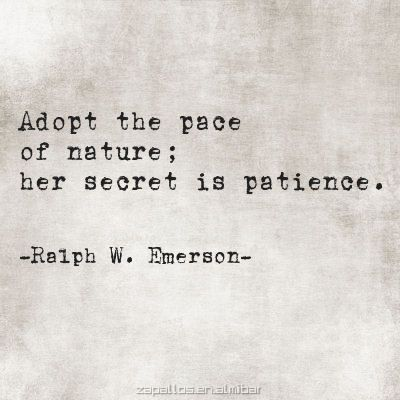

## Introduction

This is going to be a brief introduction to the benefits and practicality of collaborating on GitHub
via an organization.

# SummerOfCode2020 Github Organization

Beginning in week 04, the source of our work will be from repositories in the SummerOfCode2020 organization.

<https://github.com/SummerOfCode2020>

## An Organization

- That's us. We are a team that works on code together. With the SummerOfCode2020 organization we are connected in github.
We can now easily collaborate on code and make pull requests with any and all teaching assistants as well as any other students.
- We are diverse, supportive, and always growing and learning from each other.

## A Fork in Github, ie * How not to Fork things up *

A "fork" is a copy of a repository. Forking a repository allows you to freely experiment with changes on your personal copy independently from the original project.

A great advantage of forking the SummerOfCode2020 repositories is that we are given a page with links to navigate easily to all of the forks by all students.
(Marcus was here)
## The Process

We will be doing this every week.

- Browse to a repository within the organization as directed based on assignment
- Click the Fork button to Fork the organization's repository
- In the modal, select your Personal Workspace as the destination of the repository copy
- Paving those brain waves, turning dirt roads into highways!

## Notes

Don't "clone" the SummerOfCode2020 repositories. Only "fork" them.

Only "clone" your repositories from your workspace in github. Triple check the urls before you press the enter key in your `git clone` commands.

After we clone a repository, we usually create a new branch called `answer`

## Fixing incorrect git remotes

If you happen to make a mistake and clone a project from SummerOfCode2020, at any time you can remove your git "remotes" and replace them with your personal workspace project.

`git remote rm origin` will remove your incorrect origin.

`git remote add origin YOUR_URL_HERE` where YOUR_URL_HERE is replaced with a repository in your personal workspace.

## Push + PR
Once we have added changes to the staging area on our local repo (using git add name_of_file), we commit to the local repo (using git commit -m "Message goes here"), then we push to the correct remote (which as defined above, is the forked repository that is contained in *our* github, and will be denoted by our name.) 
## PR
When making a pull request, we *do* have to compare our previously pushed commits to the organization's code (a crucial step I actually missed previously, I've been making PRs w/in my own github repo and not referencing the org's codebase.)  Picture four, "Comparing Changes" highlights this perfectly! Each section above has to have the required codebases 

(Organizations code main -- Branch {vs} Personal code main -- Branch) 

## In Pictures

First: Fork

Next: Choose your personal github workspace as the destination

Final step on github is getting the url of your personal repository.

## Forking Guide on Github

<https://help.github.com/en/github/getting-started-with-github/fork-a-repo>

## Going back to SummerOfCode2020

Once you commit changes to your copy of a repo, you can make a pull request back to the SummerOfCode2020 repository.

Ensure that you're makign a Pull Request from your branch into the SummerofCode2020 master and then request review from JR and the TA's.

## my change - Alvin
##

Some encouragement from one of my favorite authors, trying to remember this as I study and practice.

## It's not easy
As we are in week-04, I'm still trying to fully comprehend week-02. After countless google, YouTube, W3schools, CodingJS, etc. I'm still trying. 'It is not in the pursuit of happiness that we find fulfillment, it is in the happiness of pursuit.' (Denis Waitley)
Wesley J

## Be easy on yourself
I find that taking breaks and not being so hard on yourself if what get's me through tough challenges. Looking at your code for too long can be more harmful than helpful- it is good to walk away and come back with fresh eyes. Also getting yourself outside, especially during quarantine times, is so necessary! Even opening a window helps :) 
